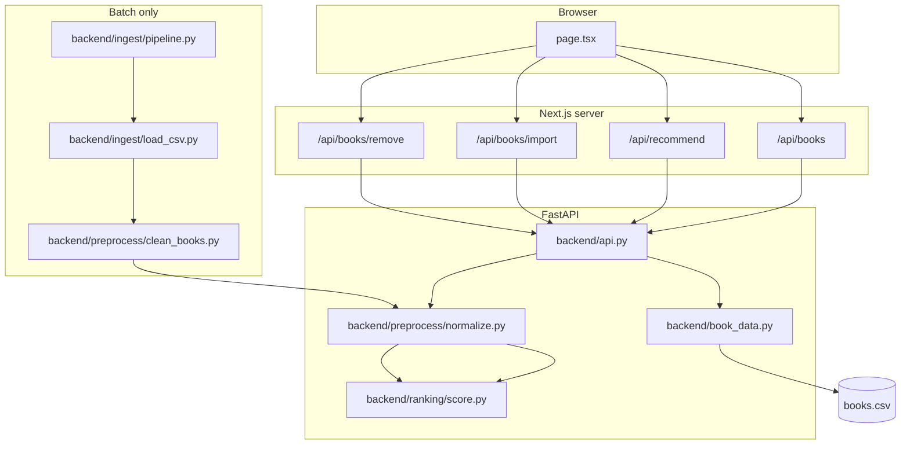

# Architecture

## Overview

LibroRank is a monorepo with three runnable surfaces:

| Surface | Stack | Entry |
|---------|-------|-------|
| API | FastAPI + pandas | `backend/api.py` |
| Web UI | Next.js (App Router) | `frontend/app/page.tsx` |
| Batch pipeline | Python modules | `backend/ingest/pipeline.py` |

All app-facing state lives in a single CSV file: `backend/data/processed/books.csv`, managed by `backend/book_data.py`.

## Component diagram

## Two data paths

### App path (UI + API + CLI)

- **Schema:** Goodreads-style columns (`Title`, `Authors`, `Read Status`, …).
- **Read/write:** `book_data.load_data()` / `save_data()`.
- **Ranking:** Called on demand in `GET /recommend`; does not persist scores to CSV.

### Batch path (flexible pipeline)

- **Schema:** Canonical lowercase fields (`title`, `author`, `read_status`, …).
- **Input:** Arbitrary user CSV + JSON mapping config.
- **Output:** In-memory ranked DataFrames (`read_ranked`, `tbr_ranked`); not automatically merged into `books.csv`.

The batch path reuses `backend/preprocess/normalize.py` and `backend/ranking/score.py` so scoring behavior stays consistent. Column name resolution in those modules accepts both canonical and app column names via `_resolve_column()`.

## Module responsibilities

| Module | Responsibility |
|--------|----------------|
| `backend/book_data.py` | Ensure CSV exists, define columns, load/save with type coercion |
| `backend/api.py` | HTTP routes, Pydantic models, shelf transitions, CORS, Render keep-warm scheduler |
| `backend/ingest/load_csv.py` | Map raw headers → canonical columns, validate, coerce types |
| `backend/ingest/pipeline.py` | `validate_uploaded_csv`, `run_flexible_pipeline` orchestration |
| `backend/preprocess/clean_books.py` | Fill missing ids, normalize status strings, default ratings |
| `backend/preprocess/normalize.py` | `rating_norm`, `recency_norm`, optional combined score |
| `backend/ranking/score.py` | Rank read/TBR lists, `recommend_one` sampling |
| `cli/manage_books.py` | Thin interactive wrapper over `backend/book_data` |

## Cross-cutting concerns

**CORS** — `backend/api.py` allows `localhost:3000`, `127.0.0.1:3000`, and the production frontend origin.

**JSON safety** — `clean_for_json()` replaces `NaN` with `null` before serializing DataFrames.

**Title as key** — Updates and deletes match on `Title` string equality. Duplicate titles are prevented on rename.

**Render keep-warm** — `AsyncIOScheduler` pings `/health` every 14 minutes during app lifespan (see `development.md`).
